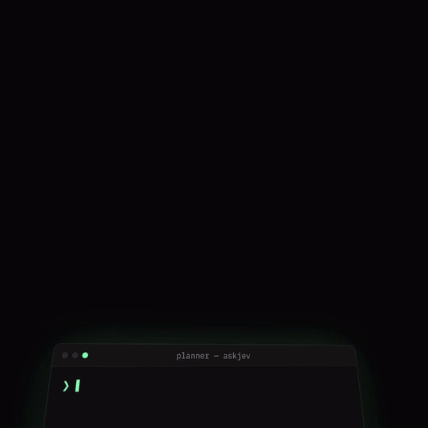
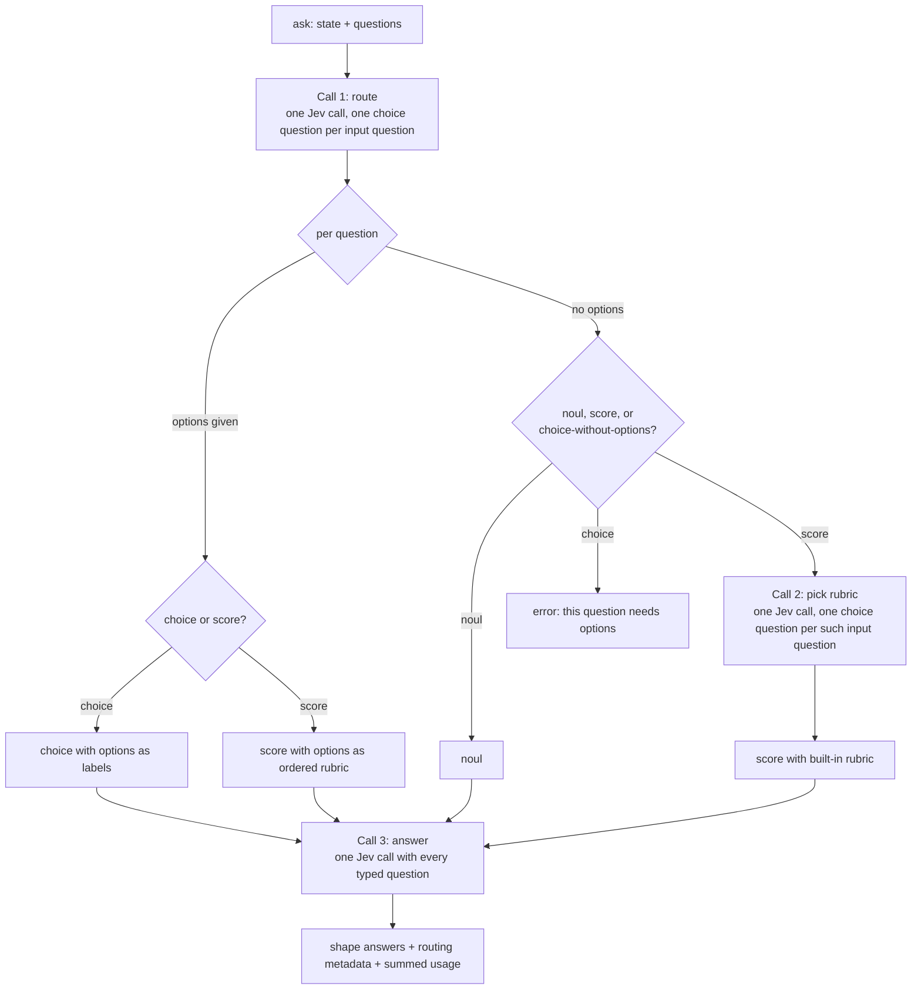

# askjev

[](https://github.com/pZacca/askjev/actions/workflows/ci.yml) [](https://github.com/pZacca/askjev/actions/workflows/eval.yml) [](https://www.npmjs.com/package/askjev) [](https://smithery.ai/servers/pzacca/askjev) [](LICENSE)

[](#claude-code) [](#claude-desktop) [](#cursor) [](#codex)

Unofficial [MCP](https://modelcontextprotocol.io) server for [Jev](https://docs.typesafe.ai),
Typesafe AI's System One model. Not affiliated with Typesafe AI.

Give your agent a fast second opinion. It asks a plain question about material it already
has, Jev works out whether that is a yes/no, a scale, or a choice, and answers with
calibrated probabilities. No generative model in the loop, one round trip, a fraction of the
cost and latency of a sub-agent.

## Demo

An agent planning a workflow, asking Jev one question at a time. Every number is real.



## Install

You need a Typesafe API key. The server runs in one of two places; every client below
supports at least one.

- **Hosted.** `https://jev.zacca.dev/mcp` runs this repository on Cloudflare Workers. It keeps
  nothing: every call builds a Typesafe client from the key you send and forwards the
  question. Send the key in the `x-api-key` header, or as a bearer token if your client
  only has that field. The same server is listed on Smithery as
  [pzacca/askjev](https://smithery.ai/servers/pzacca/askjev).
- **Local.** `npx -y askjev` runs it on your machine over stdio. Requires Node 22+ and the
  key in `TYPESAFE_API_KEY`.

### Supported clients

| Client | Local (stdio) | Hosted (HTTP) |
|---|---|---|
| [Claude Code](#claude-code) | yes | yes |
| [Claude Desktop](#claude-desktop) | yes | no, custom connectors cannot send an API key header |
| [Cursor](#cursor) | yes | yes |
| [Codex](#codex) | yes | yes, as a bearer token |

Claude Code and Codex were exercised end to end on both transports. Cursor follows its
documented configuration format.

#### Claude Code

```sh
# hosted
claude mcp add --transport http askjev https://jev.zacca.dev/mcp --header "x-api-key: your-key"

# local
claude mcp add askjev -e TYPESAFE_API_KEY=your-key -- npx -y askjev
```

#### Claude Desktop

Open Settings, Developer, Edit Config. The file is
`~/Library/Application Support/Claude/claude_desktop_config.json` on macOS and
`%APPDATA%\Claude\claude_desktop_config.json` on Windows.

```json
{
  "mcpServers": {
    "askjev": {
      "command": "npx",
      "args": ["-y", "askjev"],
      "env": { "TYPESAFE_API_KEY": "your-key" }
    }
  }
}
```

Restart Claude Desktop after saving. On Windows some hosts cannot launch `npx` directly;
use `"command": "cmd"` with `"args": ["/c", "npx", "-y", "askjev"]`.

#### Cursor

Add to `~/.cursor/mcp.json` for every project, or `.cursor/mcp.json` for one project.

```json
{
  "mcpServers": {
    "askjev": {
      "url": "https://jev.zacca.dev/mcp",
      "headers": { "x-api-key": "your-key" }
    }
  }
}
```

For a local server use the same `command`, `args` and `env` block as Claude Desktop.

#### Codex

```sh
# hosted: Codex reads the key from an environment variable and sends it as a bearer token
export TYPESAFE_API_KEY=your-key
codex mcp add askjev --url https://jev.zacca.dev/mcp --bearer-token-env-var TYPESAFE_API_KEY

# local
codex mcp add askjev --env TYPESAFE_API_KEY=your-key -- npx -y askjev
```

## The tool

One tool, `ask`. It takes the material and a list of free-text questions. Options are only
needed when the question has named alternatives.

### Input

```jsonc
{
  "state": "...",                       // string | object | array: the material to judge
  "questions": [
    { "question": "Is this a bug report?" },
    { "question": "How severe is it?" },
    { "question": "Which team owns it?", "options": ["billing", "platform", "mobile"] },
    { "question": "How urgent is it?",    "options": ["can wait", "this week", "today"] }
  ]
}
```

- `question` is free text. Jev decides whether it is a yes/no question, a scale, or a
  choice between the given options.
- `options` is optional. Pass it when the question has named alternatives. Order matters
  when the options form a scale.
- There is no way to force the question type. The whole point is that the agent does not
  have to think about it.

### Output

One entry per question, in input order.

```jsonc
{
  "model": "jev-1.13",
  "usage": { "input_tokens": 812, "output_tokens": 64 },
  "answers": [
    {
      "kind": "noul",
      "answer": 0.93,                               // probability of "yes"
      "probabilities": { "yes": 0.93, "no": 0.07 },
      "routing": { "kind": "noul", "confidence": 0.98 }
    },
    {
      "kind": "score",
      "answer": 3.4,                                // expected level, may be fractional
      "legend": { "0": "trivial", "1": "minor", "2": "moderate", "3": "major", "4": "critical" },
      "probabilities": { "0": 0.01, "1": 0.04, "2": 0.15, "3": 0.5, "4": 0.3 },
      "confidence": 0.71,
      "rubric": "severity",
      "note": "No options were given, so the built-in 'severity' rubric was used. Pass options for a rubric tailored to your question.",
      "routing": { "kind": "score", "confidence": 0.9, "rubric": { "name": "severity", "confidence": 0.84 } }
    },
    {
      "kind": "choice",
      "answer": "platform",
      "probabilities": { "billing": 0.05, "platform": 0.88, "mobile": 0.07 },
      "confidence": 0.88,
      "routing": { "kind": "choice", "confidence": 0.97 }
    },
    {
      "kind": "score",
      "answer": 1.8,
      "legend": { "0": "can wait", "1": "this week", "2": "today" },
      "probabilities": { "0": 0.1, "1": 0.2, "2": 0.7 },
      "confidence": 0.7,
      "routing": { "kind": "score", "confidence": 0.79 }
    }
  ]
}
```

A question that cannot be answered does not fail the batch. Its entry has `kind: "error"`
and a message saying what to change, and every other question is still answered:

```jsonc
{
  "kind": "error",
  "message": "\"Which team owns it?\" asks to pick between alternatives, but no options were given. Pass options with the alternatives.",
  "routing": { "kind": "choice", "confidence": 0.95 }
}
```

Everything is raw. There is no threshold and no verdict. `confidence` comes straight from
Jev; yes/no answers have no separate confidence because the probability is the signal.
`routing` exposes how sure Jev was about the question type, and about the rubric when one
was picked, so a misroute is visible rather than silent.

## How it works



Two Jev calls in the common case, three when at least one question is a scale without
options. The number of input questions does not change the number of calls: each step
batches every question that needs it into a single `systemone` request.

### Routing table

| `options` | Router decides between | Becomes |
|---|---|---|
| 2+ items | choice, score | `choice` with options as labels, or `score` with options as ordered rubric |
| absent | noul, score, choice | `noul`; `score` after picking a built-in rubric; or an error asking for options |
| 1 item | rejected by schema validation | never reaches the router |

The router's `state` is the question text itself (an object keyed by question when
batching), and its instructions ask which kind of question that text is. The routing
criteria are described in plain language so Jev discriminates on intent, not on keywords.

### Built-in rubrics

Used only for scale questions that arrive without options. A second Jev call picks the
closest one. All have five levels so Jev has room to discriminate without the levels
blurring together.

| Name | Levels, lowest to highest |
|---|---|
| `intensity` | not at all, slightly, moderately, very, extremely |
| `quality` | poor, below average, acceptable, good, excellent |
| `severity` | trivial, minor, moderate, major, critical |
| `likelihood` | very unlikely, unlikely, uncertain, likely, very likely |
| `sentiment` | very negative, negative, neutral, positive, very positive |
| `frequency` | never, rarely, sometimes, often, always |
| `agreement` | strongly disagree, disagree, neutral, agree, strongly agree |

The list is fixed in code. Configurable rubrics are a possible later addition.

## Errors

| Situation | Behaviour |
|---|---|
| Input fails schema validation | Tool error with the Zod message. Jev is not called. |
| Question routed to `choice` with no options | That entry becomes `kind: "error"` asking for `options`. The rest of the batch is answered normally. |
| Jev returns 401 | Tool error: API key missing or invalid, with the env var name. |
| Jev returns 422, 429 after retries, 5xx | Tool error with status, Jev's message, and the request id when present. |
| Network or timeout after retries | Tool error with the SDK's message. |

Errors that affect the whole call are returned as MCP tool results with `isError: true`,
not as protocol errors, so the agent sees the message and can recover. Errors that affect
one question are entries in `answers`, so one bad question never costs the agent the
others.

## Configuration

Local, only what the Typesafe SDK already reads from the environment:

| Variable | Meaning |
|---|---|
| `TYPESAFE_API_KEY` | Required. |
| `TYPESAFE_DEFAULT_MODEL` | Optional, defaults to `jev-latest`. |
| `TYPESAFE_BASE_URL` | Optional, for proxies and the smoke test stub. |
| `TYPESAFE_LOG_LEVEL` | Optional. SDK logs go to stderr. |

The server itself has no settings. stdout carries MCP protocol messages only; every
diagnostic goes to stderr.

Hosted, the key travels per request in the `x-api-key` header (or `Authorization:
Bearer`). `TYPESAFE_BASE_URL` and `TYPESAFE_DEFAULT_MODEL` can be set as Worker vars and
apply to every caller.

## Evaluation

The router is the part that can be wrong in a way unit tests cannot catch. A versioned
dataset of human-labelled questions runs against the live API weekly and on demand; the
first run scored 42/42 on routing and 16/16 on rubric selection. See
[docs/EVAL.md](docs/EVAL.md). Design decisions and rejected alternatives are in
[docs/ARCHITECTURE.md](docs/ARCHITECTURE.md).

## Development

```sh
npm ci
npm run lint
npm run typecheck
npm test
```

The hosted variant is `src/worker.ts`, bundled and deployed by wrangler from
`wrangler.jsonc`. `npm run dev` serves it on localhost; `npm run deploy` publishes it to
the configured domain (needs `wrangler login`).

The Smithery listing points at that domain and takes its configuration form from
`smithery.schema.json`. After changing the schema, republish with
`smithery mcp publish https://jev.zacca.dev/mcp -n pzacca/askjev --config-schema smithery.schema.json`.

## License

MIT
