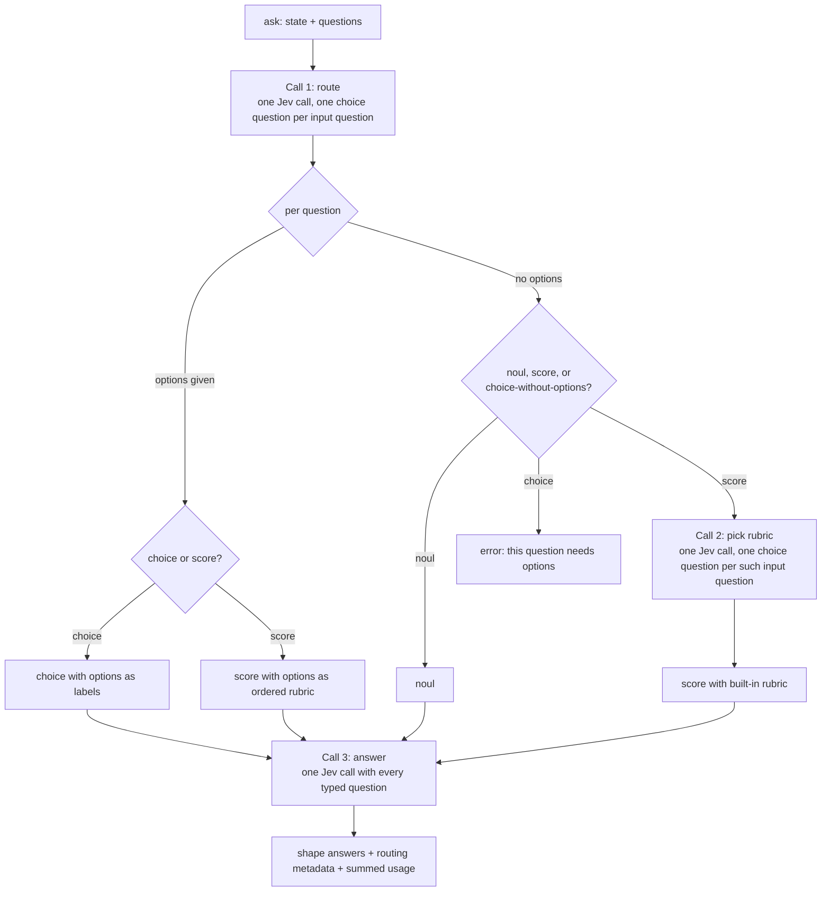
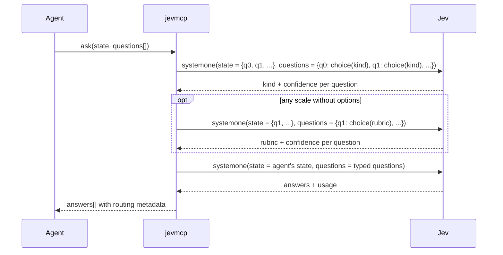

# Architecture

`jevmcp` is an MCP server that gives an agent a fast, cheap judgment call. The agent asks
free-text questions about some material it already has. The server asks Jev to decide what
kind of question each one is, asks Jev to answer it, and returns calibrated probabilities
the agent can act on. No generative model sits in the loop.

Typesafe AI calls Jev a "System One" model: fast, structured decisions rather than prose.
This server is the System One path for agents. The agent's own reasoning, or a sub-agent, is
the System Two path. The confidence figures in every response are what let the agent pick
between the two.

## The tool

One tool, `ask`.

### Input

```jsonc
{
  "state": "...",                       // string | object | array: the material to judge
  "questions": [
    { "question": "Is this a bug report?" },
    { "question": "How severe is it?" },
    { "question": "Which team owns it?", "options": ["billing", "platform", "mobile"] },
    { "question": "How urgent is it?",    "options": ["can wait", "this week", "today"] }
  ]
}
```

- `question` is free text. Jev decides whether it is a yes/no question, a scale, or a
  choice between the given options.
- `options` is optional. Pass it when the question has named alternatives. Order matters
  when the options form a scale.
- There is no way to force the question type. The whole point is that the agent does not
  have to think about it.

### Output

One entry per question, in input order.

```jsonc
{
  "model": "jev-1.13",
  "usage": { "input_tokens": 812, "output_tokens": 64 },
  "answers": [
    {
      "kind": "noul",
      "answer": 0.93,                               // probability of "yes"
      "probabilities": { "yes": 0.93, "no": 0.07 },
      "routing": { "kind": "noul", "confidence": 0.98 }
    },
    {
      "kind": "score",
      "answer": 3.4,                                // expected level, may be fractional
      "legend": { "0": "trivial", "1": "minor", "2": "moderate", "3": "major", "4": "critical" },
      "probabilities": { "0": 0.01, "1": 0.04, "2": 0.15, "3": 0.5, "4": 0.3 },
      "confidence": 0.71,
      "rubric": "severity",
      "note": "No options were given, so the built-in 'severity' rubric was used. Pass options for a rubric tailored to your question.",
      "routing": { "kind": "score", "confidence": 0.9, "rubric": { "name": "severity", "confidence": 0.84 } }
    },
    {
      "kind": "choice",
      "answer": "platform",
      "probabilities": { "billing": 0.05, "platform": 0.88, "mobile": 0.07 },
      "confidence": 0.88,
      "routing": { "kind": "choice", "confidence": 0.97 }
    },
    {
      "kind": "score",
      "answer": 1.8,
      "legend": { "0": "can wait", "1": "this week", "2": "today" },
      "probabilities": { "0": 0.1, "1": 0.2, "2": 0.7 },
      "confidence": 0.7,
      "routing": { "kind": "score", "confidence": 0.79 }
    }
  ]
}
```

A question that cannot be answered does not fail the batch. Its entry has `kind: "error"`
and a message saying what to change, and every other question is still answered:

```jsonc
{
  "kind": "error",
  "message": "\"Which team owns it?\" asks to pick between alternatives, but no options were given. Pass options with the alternatives.",
  "routing": { "kind": "choice", "confidence": 0.95 }
}
```

Everything is raw. There is no threshold and no verdict. `confidence` comes straight from
Jev; yes/no answers have no separate confidence because the probability is the signal.
`routing` exposes how sure Jev was about the question type, and about the rubric when one
was picked, so a misroute is visible rather than silent.

## Pipeline



Two Jev calls in the common case, three when at least one question is a scale without
options. The number of input questions does not change the number of calls: each step
batches every question that needs it into a single `systemone` request.

### Sequence



### Routing table

| `options` | Router decides between | Becomes |
|---|---|---|
| 2+ items | choice, score | `choice` with options as labels, or `score` with options as ordered rubric |
| absent | noul, score, choice | `noul`; `score` after picking a built-in rubric; or an error asking for options |
| 1 item | rejected by schema validation | never reaches the router |

The router's `state` is the question text itself (an object keyed by question when
batching), and its instructions ask which kind of question that text is. The routing
criteria are described in plain language so Jev discriminates on intent, not on keywords.

### Built-in rubrics

Used only for scale questions that arrive without options. A second Jev call picks the
closest one. All have five levels so Jev has room to discriminate without the levels
blurring together.

| Name | Levels, lowest to highest |
|---|---|
| `intensity` | not at all, slightly, moderately, very, extremely |
| `quality` | poor, below average, acceptable, good, excellent |
| `severity` | trivial, minor, moderate, major, critical |
| `likelihood` | very unlikely, unlikely, uncertain, likely, very likely |
| `sentiment` | very negative, negative, neutral, positive, very positive |
| `frequency` | never, rarely, sometimes, often, always |
| `agreement` | strongly disagree, disagree, neutral, agree, strongly agree |

The list is fixed in code. Configurable rubrics are a possible later addition.

## Errors

| Situation | Behaviour |
|---|---|
| Input fails schema validation | Tool error with the Zod message. Jev is not called. |
| Question routed to `choice` with no options | That entry becomes `kind: "error"` asking for `options`. The rest of the batch is answered normally. |
| Jev returns 401 | Tool error: API key missing or invalid, with the env var name. |
| Jev returns 422, 429 after retries, 5xx | Tool error with status, Jev's message, and the request id when present. |
| Network or timeout after retries | Tool error with the SDK's message. |

Errors that affect the whole call are returned as MCP tool results with `isError: true`,
not as protocol errors, so the agent sees the message and can recover. Errors that affect
one question are entries in `answers`, so one bad question never costs the agent the
others.

## Configuration

Only what the Typesafe SDK already reads from the environment:

| Variable | Meaning |
|---|---|
| `TYPESAFE_API_KEY` | Required. |
| `TYPESAFE_DEFAULT_MODEL` | Optional, defaults to `jev-latest`. |
| `TYPESAFE_BASE_URL` | Optional, for proxies and the smoke test stub. |
| `TYPESAFE_LOG_LEVEL` | Optional. SDK logs go to stderr. |

The server itself has no settings. stdout carries MCP protocol messages only; every
diagnostic goes to stderr.

## Modules

| File | Responsibility |
|---|---|
| `src/cli.ts` | Shebang entry. Builds the server, connects stdio, exits non-zero on startup failure. |
| `src/server.ts` | Creates the `McpServer`, registers `ask`, maps thrown errors to tool errors. |
| `src/schema.ts` | Zod schemas for the tool input and output, and the TypeScript types derived from them. |
| `src/ask.ts` | The pipeline: route, pick rubrics, answer, shape. Pure orchestration over a `Jev` adapter. |
| `src/router.ts` | Builds the routing and rubric-selection questions and interprets Jev's answers. |
| `src/rubrics.ts` | The built-in rubric table. |
| `src/jev.ts` | The `Jev` adapter interface and its SDK-backed implementation. |

The `Jev` adapter is one method, `systemOne(request)`. Tests inject a fake; production
wraps `TypeSafeClient`. Question-assembly tests instead inject a `fetch` into the real
client and assert on the request bodies, so serialization is exercised too.

## Decisions and rejected alternatives

**One free-text question, routed by Jev, over one tool per primitive.** Twenty-odd Jev MCP
servers appeared on the day Jev launched. Most expose `classify`, `score`, `check`. The
value here is that the agent does not learn Jev's type system.

**A minimal structural contract over pure free text.** Jev is not generative. It can say a
question is a choice but cannot extract the options from the sentence. Passing `options`
is the smallest thing the agent must do to keep a generative model out of the loop.

**Raw output over a built-in verdict.** A threshold with `verdict: "confident" | "uncertain"`
was considered. Every agent and task has a different cost of being wrong, so the threshold
belongs to the caller. Routing metadata is included for the same reason: the caller
interprets.

**No `kind` override.** It would save one call when the agent already knows the type, at
the cost of a second code path and an invitation to misuse. If the router eval shows it is
needed, it can be added with evidence.

**Batched questions over one question per call.** One Jev request carries many questions
about the same state. That is a structural advantage over a sub-agent and it would be
wasted by a single-question tool.

**Built-in rubrics chosen by Jev over an instructive error.** Most scale questions from an
agent are "how X is this", and a generic five-level rubric answers them. The `note` field
says a generic rubric was used so the agent can do better next time.

**Per-question errors over failing the batch.** A batch is one request, but the questions
are independent from the agent's point of view. Failing everything because one question
lacked options would make the agent re-send the whole batch. An error entry in the array
keeps input and output aligned by position and lets the agent fix one thing.

**One tool over `ask` plus `list_rubrics` and `list_models`.** Both lists are static and
fit in the tool description. Every extra tool costs context in every client that connects.

**stdio only.** Remote HTTP hosting would need infrastructure and per-user auth. The code
can add a transport later without touching the pipeline.
